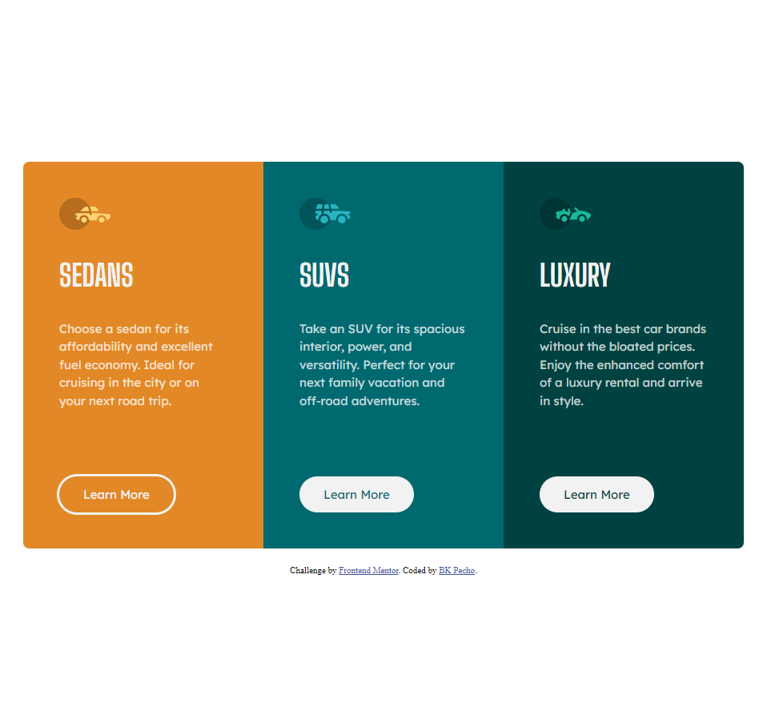

# Frontend Mentor - 3-column preview card component solution

This is a solution to the [3-column preview card component challenge on Frontend Mentor](https://www.frontendmentor.io/challenges/3column-preview-card-component-pH92eAR2-). Frontend Mentor challenges help you improve your coding skills by building realistic projects.

## Table of contents

- [Overview](#overview)
  - [The challenge](#the-challenge)
  - [Screenshot](#screenshot)
  - [Links](#links)
- [My process](#my-process)
  - [Built with](#built-with)
  - [What I learned](#what-i-learned)
  - [Useful resources](#useful-resources)
- [Author](#author)

## Overview

### The challenge

Users should be able to:

- View the optimal layout depending on their device's screen size
- See hover states for interactive elements

### Screenshot

### Links

- Solution URL: [Frontend Mentor](https://www.frontendmentor.io/solutions/3column-preview-card-component-8pk5FEa6gV)
- Live Site URL: [Netlify](https://bk-3-column-preview-card.netlify.app/)

## My process

### Built with

- HTML: Used for creating the structure and content of the website.
- BEM Naming Convention: Used to write modular, reusable CSS classes that are easy to read and maintain.
- Sass: Used to preprocess CSS and add advanced features like variables, nesting, and mixins to improve the maintainability and scalability of the codebase.
- Flexbox: Used for layout and positioning of elements on the page, providing a flexible and intuitive way to arrange content.
- Mobile-first workflow: Adopted a mobile-first approach to design and development, prioritizing the experience on smaller devices and scaling up to larger ones.
- Semantic HTML5 markup: Used HTML5 elements that describe the content of the page, making it more accessible to users and search engines.

### What I learned

BEM Naming Convention: By using the BEM methodology, I was able to write CSS that is more modular and maintainable. This helped me to organize my code and make it easier to read and understand.

Sass: I learned how to use Sass to preprocess my CSS and take advantage of features like variables, nesting, and mixins. This allowed me to write more efficient and scalable code, while reducing redundancy and improving readability.

### Useful resources

- [BEM Naming Convention](https://getbem.com/naming/) - Learn about the BEM methodology for naming CSS classes and how it can help you write scalable and maintainable code.
- [Sass Documentation](https://sass-lang.com/documentation/) - Explore the Sass documentation to learn about this powerful preprocessor language for writing CSS. Discover features like nesting, variables, mixins, and more to improve your CSS workflow.

## Author

- Github - [BK Pecho](https://www.github.com/bkpecho)
- Frontend Mentor - [@bkpecho](https://www.frontendmentor.io/profile/bkpecho)
- Twitter - [@bkpecho](https://www.twitter.com/bkpecho)
